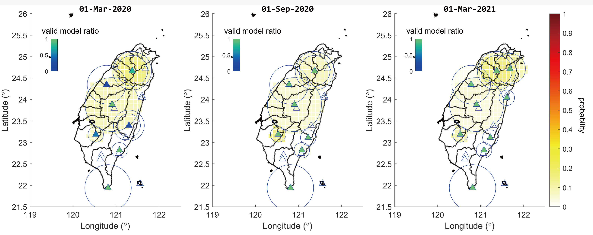
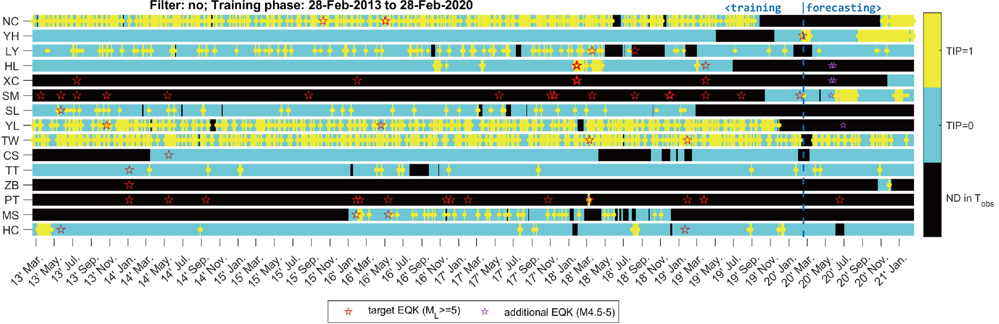

<!-- 
```
using HypertextTools
cd("doc_tutorial")
lazyhugo();
cp2content(raw"D:\GoogleDrive\Sites\CGRG\doc-archive\content\en\docs\magtip\doc_tutorial")
``` -->


## Introduction

MagTIP calculates the TIP (Time of Increased Probability) of earthquakes basing on the geomagnetic records of Central Weather Bureau of Taiwan. 
The algorithm allows for the optimization of the model parameters, and gives the overall TIP (named joint-station TIP). 
The probability of capturing a target event in space and time can be derived based on the joint-station TIP, by considering the results from a large set of randomly permuted of model parameters simultaneously.

In the traditional TIP forecasting, the type and the number of input data have to be uniquely formatted otherwise re-training according to the new format is required. 
As a result, either the conversion for fitting new data to old format (where some information must lose), or an extra waiting period (e.g. 7 years) for re-training models with new data, is required. 
The time scale of the evolution of the underground dynamical system is generally thought to be large, hence data collected from old stations are precious. For being able to fully utilizing both the data from the most modern instruments and older sensors, the project of this year aims for the multivariate MagTIP forecasting system. 

The newest multivariate MagTIP forecasting system not only supports three-component and one-component geomagnetic signals simultaneously, but also allows additional earthquake-relevant time series to be involved in calculating TIP.


## Environment
Type `license('inuse')` or `ver` to see all the toolboxes you have.


<div class="markdown"><p><strong>MATLAB Version</strong>: 9.11.0.1809720 &#40;R2021b&#41; Update 1 <strong>Operating System</strong>: Microsoft Windows 10 企業版 Version 10.0 &#40;Build 19044&#41; <strong>Java Version</strong>: Java 1.8.0_202-b08 with Oracle Corporation Java HotSpot&#40;TM&#41; 64-Bit Server VM mixed mode</p>
<p><strong>Toolbox in-use</strong>:</p>
<ul>
<li><p>MATLAB                                                Version 9.11        &#40;R2021b&#41;</p>
</li>
<li><p>Mapping Toolbox                                       Version 5.2         &#40;R2021b&#41;</p>
</li>
<li><p>Parallel Computing Toolbox                            Version 7.5         &#40;R2021b&#41;</p>
</li>
<li><p>Signal Processing Toolbox                             Version 8.7         &#40;R2021b&#41;</p>
</li>
<li><p>Statistics and Machine Learning Toolbox               Version 12.2        &#40;R2021b&#41;</p>
</li>
</ul>
</div>


## Getting Started
The main functions of MagTIP take directories that contains necessary files as input arguments, and all output variables are saved in another directory as ".mat" files.
In this document, the input/output variable that contains the information of the path to a directory (i.e., a folder) is prefixed by `dir_`; for example, `dir_data` is the directory for the formatted geomagnetic data, and `dir_stat` is the directory for statistic indices. 
The `dir_`-prefixed variables are each a sequence of characters being something like `'D:\MagTIP-2022\output_var\StatisticIndex'`. 

### The Sample Script for Everything
There is a script **"demo/demo_script.m"** contains the sample codes of the whole process; you can easily make everything set and go through the entire MagTIP procedures following the steps below:
- switch current directory to the folder named "MagTIP-2022"
- run section(s) in the script

In the beginning (the first three sections), you will see several pop-out windows for selecting the directory of geomagnetic data (`dir_data`) and loading the toolbox (`dir_toolbox`). 
Select the right folders as instructed, and they will be automatically added to path and be ready to use.

### Input/Output Directories
Assigning directories for input/output data or variables is necessary before running any application. 
For example:

```matlab
dir_catalog = 'data\spreadsheet'; 
        % directory of event catalog & station location
dir_data = 'data\geomag_1'; 
        % directory of geomagnetic timeseries
dir_stat = 'output_var\StatisticIndex'; 
        % directory of statistic indices
dir_tsAIN = 'output_var\tsAIN'; 
        % directory for storing anomaly index number (AIN)
dir_molchan = 'output_var\Molchan'; 
        % directory for storing Molchan scores
dir_jointstation = 'output_var\JointStation'; 
        % directory for the time series of EQK, TIP and probability
```

This can be done alternatively using `mkdir_default()` to create the set of empty folders with each folder name never repeats. 
That is, the code chunk above is equivalent to

```matlab
dir_catalog = 'data\spreadsheet'; 
dir_data = 'data\geomag_1';
[dir_stat, dir_tsAIN, dir_molchan, dir_jointstation] = mkdir_default('output_var')
```


Here is an overview of this default directory structure: 

<!-- `LaTeX Error: Cannot determine size of graphic in ../fig/dirtree.svg (no Bound ingBox).` when doctype is "md2pdf" -->

You can create this directory structure manually by adding new folders using your OS's interface. 
You can also assign the `dir_`-prefixed variables by using `dirselectassign(...)`, where windows pop out for selecting existing directory. 
For more information, see "demo_script.m" and "dirselectassign.m".

**⚠Notice:** 

1. `dir_spreadsheet` must contain `catalog.csv` and `station_location.csv`, with the first row (column names) being 'code', 'format', 'Lon', 'Lat' for `station_location.csv`, and 'time', 'Lon', 'Lat', 'Depth', and 'Mag' for `catalog.csv`.
2. The order of column names can be arbitrarily arranged, but the strings have to be exactly the same as above.
3. Geomagnetic time series in `dir_data` should be converted to the standard format. For more information, see `conv_geomagdata`.

## Prepare Your Data
### Format of Station list and Earthquake Catalog

The `station_location.csv` specifies the location of every station;
here is an example for `station_location.csv`: 

| code | format | Lon      | Lat      |
| ---- | ------ | -------- | -------- |
| MS   | 馬仕   | 120.633  | 22.61089 |
| TW   | 灣丘   | 120.5286 | 23.18502 |
| ...  | ...    | ...      | ...      |
| XC   | 新城   | 121.6095 | 24.0383  |
| SM   | 日月潭 | 120.9076 | 23.881   |

The `catalog.csv` is the catalog covering at least the entire range of all training phases; 
here is an example for `catalog.csv`:

| time            | Lon    | Lat   | Depth  | Mag  |
| --------------- | ------ | ----- | ------ | ---- |
| 2020/8/10 06:41 | 121.59 | 23.81 | 29.86  | 3.41 |
| 2020/8/10 06:29 | 120.57 | 22.18 | 43.54  | 3.02 |
| 2020/8/10 06:14 | 121.7  | 22.17 | 124.78 | 4.13 |
| ...             | ...    | ...   | ...    | ...  |


Also see [checkstation.m]() and [checkcatalog.m]().


### Standard data format
All records should be converted/transformed into the formatted matfiles. 
The formatted file name is generated via `standarddataname`, where


<div class="markdown"><p><code>&#91;fname&#93; &#61; standarddataname&#40;stnm, dtstr, type_j&#41;</code> returns the file name of the standard data format.  For example, <code>standarddataname&#40;&#39;HUAL&#39;, &#39;20120202&#39;, &#39;GEMS0&#39;&#41;</code> returns <code>stn&#91;HUAL&#93;dt&#91;20120202&#93;type&#91;GEMS0&#93;.mat</code>.</p>
</div>


The formatted matfile should contain only 1 field where the field name can be arbitrarily chosen. Saying the field to be `M`, `M` has to be a matrix where the column indices to time and data are assigned by function `fmt.colindex2data` depending on the type of the data. See [Library/Format](../doc_library/#format) for more information.

#### Format of Geomagnetic Data

All original files of geomagnetic timeseries have to be converted to the new format before any function that takes `dir_data` as an input argument.
You can convert the data by simply applying:

```matlab
conv_geomagdata(dir_originalfiles, dir_data)
```
In which, 
- `conv_geomagdata` takes two required input argument. The first is the directory of original files, and the second is the output folder for the new files.
- The naming of original files should be "yyyymmdd.StationCode" or "yyyymmddHH.StationCode". For example, "20150202.MS" and  "2015020223.MS", respectively.
- The naming criteria for new files is "stn[StationCode]dt[yyyymmdd]type[DataType].mat". For example, "stn[MS]dt[20150202]type[full].mat" is the formatted geomagnetic data converted from "20150202.MS", which is a one-component time series. 
- The process of conversion may take very long if the number of files to be converted is large. Use the option `'ContinueFromLast'` and `'FilterByDatetime'` to avoid repeatedly converting the files that have already been converted before.
- For more information, see "conv_geomagdata.m".


## The Main Process
After all data are prepared (those in `dir_data` and `dir_spreadsheet`), you can run the whole forecasting process simply with:
```matlab
statind(dir_data,dir_stat); % For multi-threading, use statind_parfor(...) 
anomalyind(dir_stat,dir_tsAIN); 
molscore(dir_tsAIN,dir_catalog,dir_molchan); % For multi-threading, use molscore_parfor(...)
molscore3(dir_tsAIN,dir_molchan,dir_catalog,dir_jointstation); %For multi-threading, use molscore3_parfor(...) 
```
In which, `statind` calculates specific statistical quantities of each day; `anomalyind` calculates anomaly index according to different $A_\text{thr}$ threshold; `molscore` gives optimized models; and `molscore3` use optimized models to calculate probability forecasts.

## Visualization of the Results
There are several tools provided for visualizing the result. For detailed information about these tools, please refer to the [Library/Tools/Plotting](../doc_library/#plotting).

There is also a script **"demo/demo_visualization.m"**; you can easily obtain plots of the results following the steps below:
- switch current directory to the folder named "MagTIP-2022"
- run section(s) in the script"


### Probability Forecast
`plotProbability` visualizes the probability of the calculated results (which is stored in `dir_jointstation` in default), with options for whether to plot epicenters of target events (目標地震) and for specifying the date time to plot, as an example:

```matlab
dir_prob = fullfile(dir_jointstation,'png','prob');
dates2plot = [datetime(2020,3,1):calmonths(6):datetime(2021,3,1)];
plotProbability(dir_jointstation,dir_catalog,dir_prob,...
    'TimeRange',dates2plot,'PlotEpicenter','all');
```


> In this figure, the triangle denotes the location of station; circle(s) around each station denote the maximum and minimum range of detection ($R_C$) of the models that are responsible for calculating the TIPs; the filled color of the triangle denotes the ratio of valid models of the day; and hollow triangle denotes the station that cannot provide TIP for the day.


### The Matching Diagram
`plotEQKTIP1` provides the 1-dimensional match diagram of a specific model.

```matlab
dir_png = fullfile(dir_molchan,'png','EQKTIP');
plotEQKTIP1(dir_tsAIN,dir_molchan,dir_catalog,dir_png,...
            'ForecastingPhase',calyears(1),'ShowTrainingPhase',1,'Rank',1,...
            'ForceMagnitude',-0.5,'scatter',1);
```


> In this figure, the match diagram of EQK and TIP defined by the model of first rank is demonstrated. The intervals of black color denotes the days where there is no data in $T_\text{obs}$ at all (i.e. this model is invalid at these time) and hence TIP cannot be calculated.

